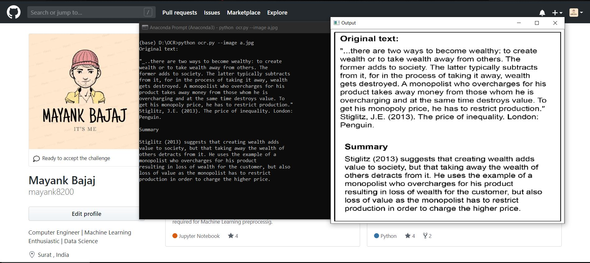

# Using-Tesseract-OCR-to-extract-text-from-images
Tesseract works best when there is a (very) clean segmentation of the foreground text from the background. In practice, it can be extremely challenging to guarantee these types of segmentations. Hence, we tend to train domain-specific image classifiers and detectors.  Nevertheless, it’s important that we understand how to access Tesseract OCR via the Python programming language in the case that we need to apply OCR to our own projects (provided we can obtain the nice, clean segmentations required by Tesseract).

# Using Tesseract OCR with Python
First, we’ll learn how to install the pytesseract package so that we can access Tesseract via the Python programming language.

Next, we’ll develop a simple Python script to load an image, binarize it, and pass it through the Tesseract OCR system.

Finally, we’ll test our OCR pipeline on some example images and review the results.

# Installing the Tesseract + Python “bindings”
Let’s begin by getting pytesseract  installed. To install pytesseract  we’ll take advantage of pip .
Next let’s install Pillow, a more Python-friendly port of PIL (a dependency) followed by pytesseract .

-`pip install pillow`

-`pip install pytesseract`

Note: pytesseract  does not provide true Python bindings. Rather, it simply provides an interface to the tesseract  binary. If you take a look at the project on GitHub you’ll see that the library is writing the image to a temporary file on disk followed by calling the tesseract  binary on the file and capturing the resulting output. This is definitely a bit hackish, but it gets the job done for us.

# How to Run the file
python ocr.py --image a.jpg
Here a.jpg is the image name.

# Screenshot of Implementation

